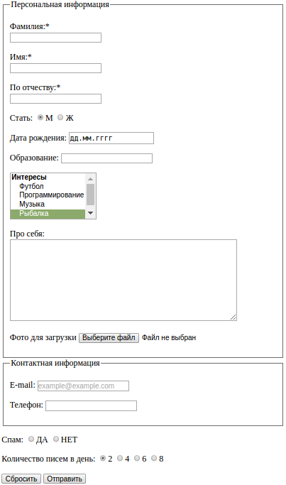

- [Лабораторна робота 2](#Лабораторна-робота-2)
- [Лабораторна робота 3](#Лабораторна-робота-3) 
			
### Лабораторна робота 2
**Тема:** Створення html-документів з таблицями

**Мета:** Навчитися створювати таблиці заданого розміру; навчитися об'єднувати ячейки по горизонталі і вертикалі; навчитися створювати фіксовані таблиці.

**Таблиця 1**
<table><caption>Table 1</caption><thead><tr><th>Album</th><th>Year</th></tr></thead><tbody><tr><td>Transmissions</td><td>1993</td></tr><tr><td>Luciana</td><td>1994</td></tr><tr><td>Beyond the Infinite</td><td>1995</td></tr><tr><td>Bible of Dreams</td><td>1997</td></tr><tr><td>Shango</td><td>2000</td></tr><tr><td>Labyrinth</td><td>2004</td></tr><tr><td>Gods & Monsters</td><td>2008</td></tr><tr><td>The Golden Sun of The Great East</td><td>2013</td></tr></tbody></table>

```html
<table>
		<caption>Table 1</caption>
		<thead>
			<tr>
				<th>Album</th>
				<th>Year</th>
			</tr>
		</thead>
		<tbody>
			<tr>
				<td>Transmissions</td>
				<td>1993</td>
			</tr>
			<tr>
				<td>Luciana</td>
				<td>1994</td>
			</tr>
		</tbody>
	</table>
</div>
```


**Таблиця 2**
<table><thead><tr><th>1:00</th><th>2:00</th><th>3:00</th></tr></thead><tbody><tr><td colspan="3">lorem2</td></tr><tr><td>lorem2</td><td>lorem2</td><td>lorem2</td></tr><tr><td>lorem2<td colspan="2">lorem2</td></td></tr></tbody></table>
```html
<table>
		<caption>Table 1</caption>
		<thead>
			<tr>
				<th>Album</th>
				<th>Year</th>
			</tr>
		</thead>
		<tbody>
			<tr>
				<td>Transmissions</td>
				<td>1993</td>
			</tr>
			<tr>
				<td>Luciana</td>
				<td>1994</td>
			</tr>
		</tbody>
	</table>
</div>
```


**Таблиця 3**
<table><tbody><tr><td>lorem2<td rowspan="3">lorem2</td><td>lorem2</td></td></tr><tr><td>lorem2<td rowspan="2">lorem2</td></td></tr><tr><td>lorem2</td></tr></tbody></table>
```html
	<table>
		<caption>Table 3</caption>
		<tbody>
			<tr>
				<td>lorem2
					<td rowspan="3">lorem2</td>
					<td>lorem2</td>
				</td>
			</tr>
			<tr>
				<td>lorem2
					<td rowspan="2">lorem2</td>
				</td>
			</tr>
			<tr>
				<td>lorem2</td>
			</tr>
		</tbody>
	</table>
</div>
```

**Таблиця 4**
<table><caption>TABLE 4</caption><tbody><tr><td rowspan="2"></td><th colspan="2">Заголовок для 2 подзаголовков</th><th rowspan="2">Заголовок 3</th></tr><tr><th>Заголовок 1</th><th>Заголовок 2</th></tr><tr><th scope="row">Пункт А</th><td>Данные А1</td><td>Данные А2</td><td>Данные А3</td></tr><tr><th scope="row">Пункт Б</th><td>Данные Б1</td><td>Данные Б2</td><td>Данные Б3</td></tr><tr><th scope="row">Пункт В</th><td>Данные В1</td><td>Данные В2</td><td>Данные В3</td></tr></tbody></table>
```html
	<table>
		<caption>TABLE 4</caption>
		<tbody>
			<tr>
				<td rowspan="2"></td>
				<th colspan="2">Заголовок для 2 подзаголовков</th>
				<th rowspan="2">Заголовок 3</th>
			</tr>
			<tr>
				<th>Заголовок 1</th>
				<th>Заголовок 2</th>
			</tr>
			<tr>
				<th scope="row">Пункт А</th>
				<td>Данные А1</td>
				<td>Данные А2</td>
				<td>Данные А3</td>
			</tr>
			<tr>
				<th scope="row">Пункт Б</th>
				<td>Данные Б1</td>
				<td>Данные Б2</td>
				<td>Данные Б3</td>
			</tr>
			<tr>
				<th scope="row">Пункт В</th>
				<td>Данные В1</td>
				<td>Данные В2</td>
				<td>Данные В3</td>
			</tr>
		</tbody>
	</table>
```
**Висновок:** Я навчився створювати таблиці заданого розміру; навчився об'єднувати ячейки по горизонталі і вертикалі; навчився створювати фіксовані таблиці.

### Лабораторна робота 3
**Тема:** Створення форм за допомогою HTML

**Мета:** Навчитися створювати форми і вказувати обробників форм;
Навчитися створювати елементи управління форми.


**Завдання**


*Створити форму form.html для заповнення анкети (див. зразок нижче). Збережіть файл у попередньо створеній папці lab02. Зв’язати сторінки index.html та form.html посиланнями.*



 ```html
  <form action="" method="GET" " enctype="multipart/form-data">
    <fieldset>
      <legend>Персональная информация</legend>
      <p>
        <label for="name">Фамилия:*
          <br>
          <input type="text" name="name">
        </label>
      </p>
      <p>
        <label for="name">Имя:*
          <br>
          <input type="text" name="name">
        </label>
      </p>
      <p>
        <label for="name">По отчеству:*
          <br>
          <input type="text" name="name">
        </label>
      </p>
      <p>
        <label for="gender">Стать:
          <input type="radio" value="m" name="gender" checked="">М
          <input type="radio" value="w" name="gender">Ж
        </label>
      </p>
      <p>
        <label for="date">Дата рождения:
          <input type="date" name="date">
        </label>
      </p>
      <p>
        <label for="edu">Образование:
          <input type="text" list="edu" name="edu">
          <datalist id="edu">
            <optgroup value="vnz">
              <option value="Колледж">1</option>
              <option value="ПТУ">2</option>
              <option value="Школа">3</option>
            </optgroup>
          </datalist>
        </label>
      </p>
      <p>
        <select size="5" multiple name="interests">
          <optgroup label="Интересы">
            <option value="Футбол">Футбол</option>
            <option value="Программирование">Программирование</option>
            <option value="Музыка">Музыка</option>
            <option selected value="Рыбалка">Рыбалка</option>
            <option value="Ничего">Ничего</option>
          </optgroup>
        </select>
      </p>
      <p><label for="about">Про себя:
          <br>
          <textarea name="about" id="" cols="50" rows="10"></textarea>
        </label>
      </p>
      <p><label for="file">Фото для загрузки
            <input type="file" name="file">
         </label>
      </p>
    </fieldset>
    <fieldset>
      <legend>Контактная информация</legend>
      <p><label for="email">E-mail:</label>
        <input type="email" name="email" placeholder="example@example.com">
      </p>
      <p><label for="tel">Телефон:</label>
        <input type="tel" name="tel">
      </p>
    </fieldset>
    <p><label for="spam">Спам:
          <input type="radio" value="y" name="spam">ДА
          <input type="radio" value="n" name="spam">НЕТ
      </label>
    </p>
    <p>
      <label for="letters">Количество писем в день:
        <input type="radio" name="letters" value="2" checked="">2
        <input type="radio" name="letters" value="4">4
        <input type="radio" name="letters" value="6">6
        <input type="radio" name="letters" value="8">8
      </label>
    </p>
    <p>
      <input type="reset">
    </p>
    <p>
      <input type="submit">
    </p>
  </form>

 ```

**Висновок:** Я навчився створювати форми і вказувати обробників форм;
Навчився створювати елементи управління форми.
