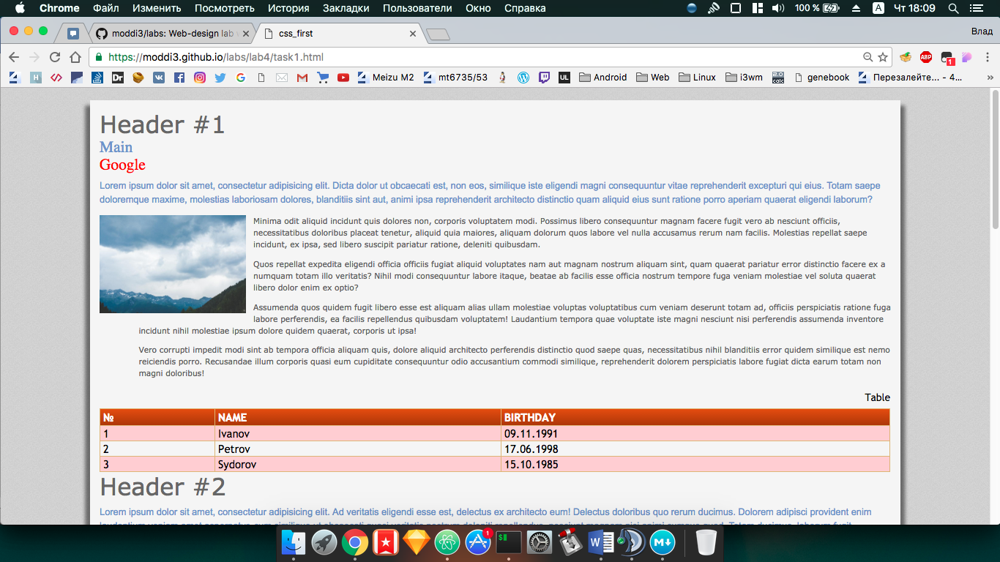

### Лабораторна робота 4
**Тема:** Ознайомлення з правилами побудови каскадних таблиць стилів. Типи стилів

**Мета:** Навчитися застосовувати різні типи стилів CSS при оформленні веб-сторінок.


**Завдання**




 ```html
<!DOCTYPE html>
<html lang="en">

<head>
  <meta charset="UTF-8">
  <title>css_first</title>
  <link rel="stylesheet" href="css/main.css">
  <style>
    h1 {
      color: #666;
      font-size: 3em;
      margin: 0;
    }

    p {
      color: #616161;
      line-height: 150%;
      margin-top: 10px;
      margin-left: 80px;
    }
  </style>
</head>

<body>
  <section>
    <article>
      <header>
        <h1>Header #1</h1>
      </header>
      <nav>
        <a href="../index.html">Main</a><br>
        <a href="https://google.com">Google</a>
      </nav>
      <p class="intro">Lorem ipsum dolor sit amet, consectetur adipisicing elit.</p>
      <div class="stock">
        
      </div>
      <p>Minima odit aliquid incidunt dolores non, corporis voluptatem modi.</p>
      <table class="inventory">
        <caption>Table</caption>
        <thead>
          <tr>
            <th>№</th>
            <th>Name</th>
            <th>Birthday</th>
          </tr </thead>
          <tbody>
            <tr>
              <td>1</td>
              <td>Ivanov</td>
              <td>09.11.1991</td>
            </tr>
            <tr>
              <td>2</td>
              <td>Petrov</td>
              <td>17.06.1998</td>
            </tr>
            <tr>
              <td>3</td>
              <td>Sydorov</td>
              <td>15.10.1985</td>
            </tr>
          </tbody>
      </table>
    </article>
    <article>
      <header>
        <h1>Header #2</h1>
      </header>
      <p>Minima odit aliquid incidunt quis dolores non, corporis modi.</p>
    </article>
    <article>
      <header>
        <h1>Header #3</h1>
      </header>
      <p>Molestias repellat libero suscipit pariatur ratione, deleniti quibusdam.</p>
    </article>
    <article>
      <header>
        <h1>Header #4</h1>
      </header>
     <p>Minima odit aliquid quis dolores non, corporis voluptatem modi.</p>
    </article>
    <article>
      <header>
        <h1>Header #5</h1>
      </header>
      <p> 
      Possimus libero consequuntur facere fugit vero ab nesciunt officiis.</p>
    </article>
  </section>
</body>

</html>

 ```

**Висновок:** Я навчився застосовувати різні типи стилів CSS при оформленні веб-сторінок.
