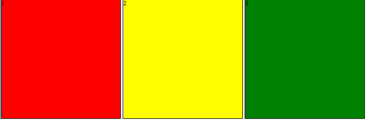
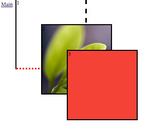

### Лабораторна робота 5
**Тема:** Створення веб-сторінок з використанням CSS

**Мета:** Закріпити навички роботи із блочними, плаваючими елементами, використання класів, застосування позиціонування.

**Світлофор**


```html
<div class="light1 lights">1</div>
<div class="light2 lights">2</div>
<div class="light3 lights">3</div>
```
```css
.lights{
  width: 300px; height: 300px;
  border:1px solid #000;
  display:inline-block;
}
.light1{
  background-color: red;
} 
.light2{
  background-color: yellow;
}
.light3{
  background-color: green;
}
```
**Blocks**


```html
<div class="block1 blocks">1</div>
<div class="block2 blocks">2</div>
<div class="block3 blocks">3</div>
```
```css
.blocks{
  width: 200px;
  height: 200px;
  border:3px solid #000;
  position: absolute;
}
.block1{
  border-right: 5px dashed;
  border-bottom: 5px red dotted; 
  z-index: 5;
  left:50px;
  top:0;
}
.block2{
  background-image: url("img/148.jpg");
  -webkit-background-size: cover;
  background-size: cover;
  z-index: 10;
  left:125px;
  top: 75px;
}
.block3{
  background-color: #F44336;
  z-index: 20;
  top: 150px;
  left: 200px;
}
```

**Header**

```html
<header>
  <div class="col1"><span><a href="../index.html">Шапка</a></span></div>
    <div class="col2">
	  <span>
	    <time datetime="2016-09-21">21 вересня</time> 
	    <div class="separator"></div><time>15:13</time>
	  </span>
	</div>
</header>
```
```css
body{
  width: 80%;
  margin: 15px auto;
}
header{
  line-height: 50px;
  border:1px solid #dedede; border-radius: 3px;
  position: relative;
  height: 50px;
  min-width: 600px; min-height: 50px; 
}
header > div{
  position: absolute;
}
.col1{
  width: 50%; left: 15px;
}
.col2{
  width: 50%; right: 0px;
}
.col2 > span{
  position: absolute;
  right:15px;
}
.separator{
  display: inline-block;
  width: 0px;
  height: 12px;
  border-right: 1px solid #dedede;
  padding: 0;
}
```
**Висновок:** Я закріпив навички роботи із блочними, плаваючими елементами, використання класів, застосування позиціонування.